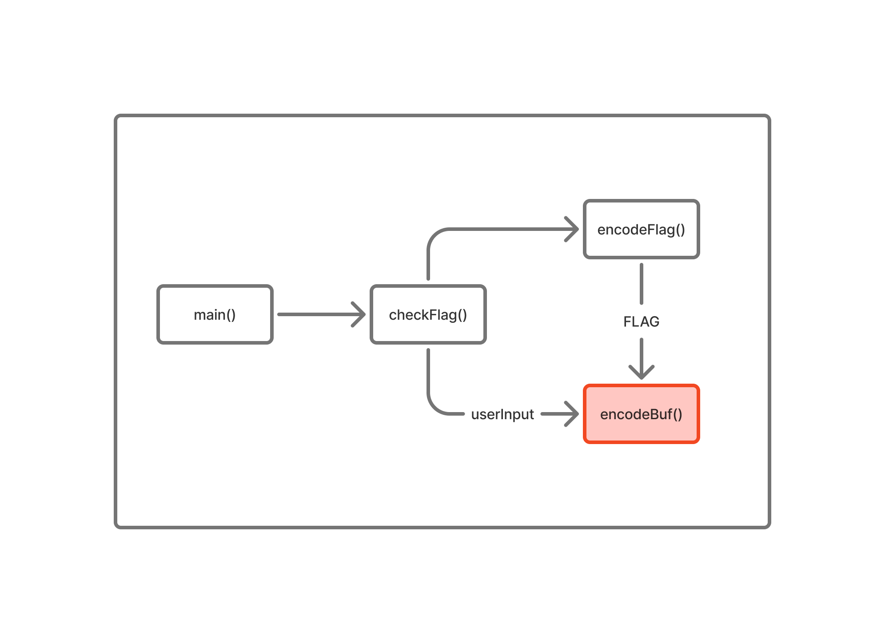

# 아 문제 이름 뭐로하지 - Dreamhack
## Challenge Info
- Date: 2025
- CTF Name: Dreamhack
- Category: rev
- Difficulty (subjective): easy
- Points: 1
- Provided Files: chall(ELF)
- tools: Ghidra
## Brief Description
this is simple reversing challenge  
format: DH{~}
## Initial Analysis
### main()
``` c
undefined8 main(void) {
  int iVar1;
  size_t sVar2;
  long in_FS_OFFSET;
  char inputFlagBuf [136];
  long canary;
  
  canary = *(long *)(in_FS_OFFSET + 0x28);
  printf("Enter flag: ");
  fgets(inputFlagBuf,0x80,stdin);
  sVar2 = strcspn(inputFlagBuf,"\n");
  inputFlagBuf[sVar2] = '\0';
  iVar1 = checkFlag(inputFlagBuf);
  if (iVar1 == 0) {
    puts("wrong");
  }
  else {
    puts("correct");
  }
  if (canary != *(long *)(in_FS_OFFSET + 0x28)) {
                    /* WARNING: Subroutine does not return */
    __stack_chk_fail();
  }
  return 0;
}
```
사용자로부터 입력을 받아 `checkFlag()`을 호출하며 입력값을 전달한다.  
### checkFlag()
``` c
bool checkFlag(char *inputFlagBuf) {
  int cmpVal;
  size_t bufLen;
  long in_FS_OFFSET;
  bool rv;
  undefined8 inputFlagBufAddr;
  undefined8 local_70;
  undefined8 local_68;
  undefined8 local_60;
  undefined4 local_58;
  undefined2 local_54;
  char local_52;
  undefined1 buf [40];
  long canary;
  
  canary = *(long *)(in_FS_OFFSET + 0x28);
  bufLen = strlen(inputFlagBuf);
  if (bufLen == 0x27) {
    inputFlagBufAddr = *(undefined8 *)inputFlagBuf;
    local_70 = *(undefined8 *)(inputFlagBuf + 8);
    local_68 = *(undefined8 *)(inputFlagBuf + 0x10);
    local_60 = *(undefined8 *)(inputFlagBuf + 0x18);
    local_58 = *(undefined4 *)(inputFlagBuf + 0x20);
    local_54 = *(undefined2 *)(inputFlagBuf + 0x24);
    local_52 = inputFlagBuf[0x26];
    encodeBuf(&inputFlagBufAddr,0x27);
    encodeFlag(buf);
    cmpVal = memcmp(&inputFlagBufAddr,buf,0x27);
    rv = cmpVal == 0;
  }
  else {
    rv = false;
  }
}
```
사용자의 입력값과 FLAG를 `encodeBuf()`를 통해서 인코딩한 후 비교 결과를 반환한다.  
### encodeFlag()
``` c
void encodeFlag(undefined8 *buf) {
  long in_FS_OFFSET;
  ulong idx;
  undefined8 local_48;
  undefined8 local_40;
  undefined8 local_38;
  undefined8 local_30;
  undefined4 local_28;
  undefined2 local_24;
  undefined1 local_22;
  long canary;
  
  canary = *(long *)(in_FS_OFFSET + 0x28);
  for (idx = 0; idx < 0x27; idx = idx + 1) {
    *(byte *)((long)&local_48 + idx) = (&DAT_00102120)[idx] ^ 0xaa;
  }
  *buf = local_48;
  buf[1] = local_40;
  buf[2] = local_38;
  buf[3] = local_30;
  *(undefined4 *)(buf + 4) = local_28;
  *(undefined2 *)((long)buf + 0x24) = local_24;
  *(undefined1 *)((long)buf + 0x26) = local_22;
  encodeBuf(buf,0x27);
  if (canary != *(long *)(in_FS_OFFSET + 0x28)) {
                    /* WARNING: Subroutine does not return */
    __stack_chk_fail();
  }
  return;
}
```
바이너리 내부의 데이터에서 FLAG 값을 추출 및 `encodeBuf()`를 통해 인코딩을 진행한다.  
### encodeBuf()
``` c
void encodeBuf(long buf,ulong len) {
  byte tmp;
  char encoded;
  byte acc;
  ulong idx;
  byte pureVal;
  
  acc = 0;
  for (idx = 0; idx < len; idx = idx + 1) {
    pureVal = (byte)idx;
    tmp = ((pureVal & 7) - 0x22) * (-0x53 - (pureVal & 7));
    encoded = cal((tmp + pureVal ^ *(byte *)(idx + buf)) +
                  (&DAT_00102020)[(int)(uint)(pureVal ^ tmp)],
                  ((int)idx - ((int)(idx / 7 << 3) - (int)(idx / 7))) + 3);
    acc = encoded * '\x03' + 7U ^ acc + pureVal;
    *(byte *)(buf + idx) = acc;
  }
  return;
}
```
받아온 문자열을 인코딩한다.  
## PoC(Poof of Concept)
### Flow Diagram

로직을 보면 계산이 많아 역연산 과정이 길어질 것 같지만, 입력값과 FLAG 모두 같은 인코딩을 적용하고 비교한다. 사실상 입력값과 FLAG를 그대로 비교하는 것과 다름없다. 따라서 실질적인 역연산은 FLAG를 추출하는 과정은 1개다. 
``` python
flag = bytes([
    0xee, 0xe2, 0xd1, 0xfa, 0xc6, 0xcf, 0xcb, 0xd9,
    0xcf, 0xf5, 0xc6, 0xc5, 0xdc, 0xcf, 0xf5, 0xde,
    0xc2, 0xcf, 0xf5, 0xed, 0xee, 0xf5, 0xff, 0xe8,
    0xef, 0xf8, 0xe7, 0xef, 0xf9, 0xe2, 0xf5, 0xcb,
    0xc6, 0xc8, 0xdf, 0xc7, 0x8b, 0x8b, 0xd7
])

encodedFlag = bytearray()
for i in range(len(flag)) :
    encodedFlag.append(flag[i] ^ 0xaa)

print(str(encodedFlag))
```